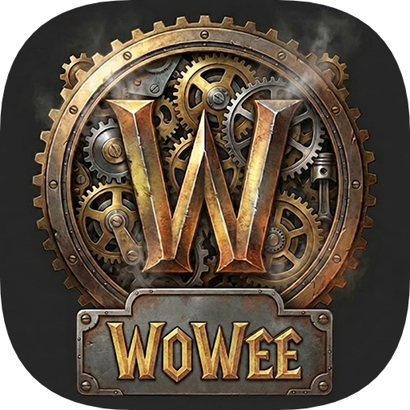
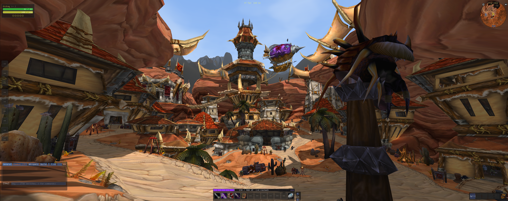
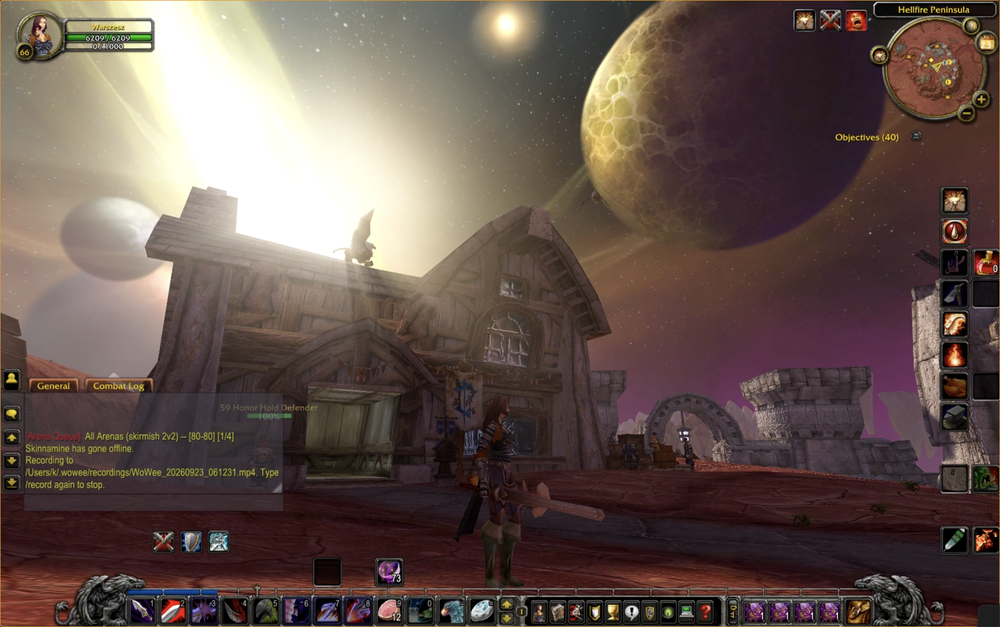
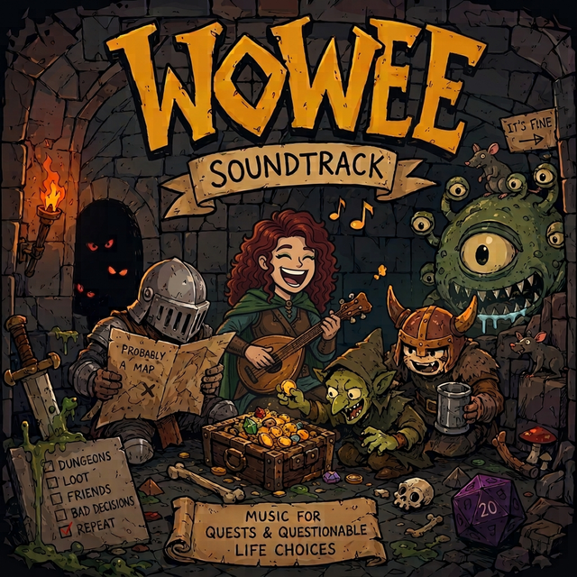

# WoWee - World of Warcraft Engine Experiment

<p align="center">
  
</p>

<p align="center">
  A native C++ World of Warcraft client with a custom Vulkan renderer.
</p>

<p align="center">
  <a href="https://github.com/sponsors/Kelsidavis"></a>
  <a href="https://discord.gg/PSdMPS8uje"></a>
</p>

WoWee supports **Vanilla 1.12**, **TBC 2.4.3**, and **WotLK 3.3.5a** through
expansion-specific profiles and packet parsers. It has been tested with
AzerothCore/ChromieCraft, TrinityCore, MaNGOS, and Turtle WoW 1.18.

[Watch the latest demonstration](https://youtu.be/1Ax1jeNV_GU) ·
[Download the latest release](https://github.com/Kelsidavis/WoWee/releases/latest) ·
[Read the project status](docs/status.md) ·
[Hear the soundtrack](https://kelsidavis.bandcamp.com/album/wowee-soundtrack)

<p align="center">
  
</p>

<p align="center">
  
</p>

> [!NOTE]
> macOS release DMGs are Developer ID signed, notarized by Apple, and stapled
> before publication. Gatekeeper should identify them as notarized Developer ID
> software without requiring an **Open Anyway** exception.

> [!IMPORTANT]
> WoWee is an educational and research project. It contains no Blizzard
> Entertainment assets, data, or proprietary code. You must supply your own
> legally obtained game data and comply with the laws in your jurisdiction.
> WoWee is not affiliated with or endorsed by Blizzard Entertainment.

## What works

- Vulkan 1.3 terrain, WMO, M2, water/lava, particles, lighting, shadows,
  weather, and asynchronous world streaming
- SRP6 authentication, RC4 header encryption, and protocol handling for all
  three supported expansions
- Character creation and selection, movement, transports, combat, spells,
  talents, inventory, banks, vendors, trainers, quests, loot, mail, auction
  house, gossip, chat, parties, pets, maps, and taxi travel
- Blizzard's own FrameXML interface, loaded from your game data and drawn by
  the client; addons in the game's `Interface\AddOns` folder load too
- An asset builder, inside the client and as the standalone `wowee_assets`
  window, that extracts your own game installation
- Keyboard and mouse, or a game controller with Xbox, PlayStation, Nintendo
  and Steam Deck button names
- Zone and city music, tavern and weather ambience, footsteps, mounts, combat,
  spell and NPC voice audio
- Optional Warden module execution through Unicorn Engine x86 emulation
- Linux, macOS and Windows on x86-64 and ARM64, and **Android on arm64** with
  on-screen controls

This is an active work in progress, not a drop-in replacement for the official
client. See [Known limitations](#known-limitations) before reporting a bug.

### Experimental components

The world editor and AMD FSR3 frame generation are early developer features.
Their interfaces, formats, runtime requirements, and behavior may change. Frame
generation is only built when `WOWEE_ENABLE_AMD_FSR3_FRAMEGEN` is turned on
with AMD's SDK under `extern/`. FSR 1 and FSR 3 upscaling are built in, but
graphics acceleration features are still under active development and should
not be treated as release-critical functionality. Grass is marked experimental
in the settings.

## Quick start

### 1. Install dependencies

The desktop build uses SDL3 and needs a Vulkan 1.3 driver (MoltenVK on
macOS). Unicorn enables Warden execution. StormLib is needed by
`asset_extract`, the `wowee_assets` window and the asset builder inside the
client; without it the client still builds, with those left out.

<details>
<summary>Ubuntu / Debian</summary>

```bash
sudo apt install build-essential cmake pkg-config git \
  libsdl3-dev libglm-dev libssl-dev zlib1g-dev libx11-dev \
  libvulkan-dev vulkan-tools glslc \
  libavformat-dev libavcodec-dev libswscale-dev libavutil-dev

# Optional: Warden execution and MPQ extraction
sudo apt install libunicorn-dev
sudo apt install libstorm-dev
```

`libsdl3-dev` is in Ubuntu 25.04 and Debian 13 onward. On Ubuntu 24.04, build
SDL3 from source and install it, as CI does with `release-3.2.24`.

</details>

<details>
<summary>Fedora</summary>

```bash
sudo dnf install gcc-c++ cmake pkgconf-pkg-config git \
  SDL3-devel glm-devel openssl-devel zlib-devel libX11-devel \
  vulkan-devel vulkan-tools glslc ffmpeg-devel

# Optional: Warden execution
sudo dnf install unicorn-devel
```

For the asset tools, build [StormLib](https://github.com/ladislav-zezula/StormLib)
from source if it is unavailable in your enabled Fedora repositories.

</details>

<details>
<summary>Arch Linux</summary>

```bash
sudo pacman -S base-devel cmake pkgconf git \
  sdl3 glm openssl zlib libx11 \
  vulkan-headers vulkan-icd-loader vulkan-tools shaderc \
  ffmpeg
```

Install `unicorn` for optional Warden execution. StormLib is not in the official
repositories; install `stormlib-git` from the AUR if you need the asset tools.

</details>

<details>
<summary>macOS</summary>

Vulkan runs through MoltenVK.

```bash
brew install cmake pkg-config sdl3 glm openssl@3 zlib ffmpeg \
  vulkan-loader vulkan-headers molten-vk shaderc

# Optional: Warden execution and MPQ extraction
brew install unicorn stormlib
```

</details>

For Windows/MSYS2, Visual Studio, and platform-specific notes, see the
[complete build guide](BUILD_INSTRUCTIONS.md).

### 2. Clone and build

```bash
git clone --recurse-submodules https://github.com/Kelsidavis/WoWee.git
cd WoWee

cmake -S . -B build -DCMAKE_BUILD_TYPE=Release
cmake --build build --parallel
```

The `build.sh` and `build.ps1` helpers run the same build and also clone AMD's
FidelityFX SDKs into `extern/`. Those are only used when `WOWEE_ENABLE_AMD_FSR2`
or `WOWEE_ENABLE_AMD_FSR3_FRAMEGEN` is turned on, and both are off by default;
the client's own FSR 1 and FSR 3 upscaling need neither.

### 3. Extract game data

WoWee does not read MPQs at runtime. It needs a loose-file tree with a
generated `manifest.json`, extracted from a legally obtained client.

The asset builder does this. When the client starts and finds nothing
extracted, it opens the builder instead of the login screen; later it is under
**more options** → **add or rebuild assets...** on the login screen, and it is
also the standalone `wowee_assets` window. Point it at your World of Warcraft
folder and it extracts into the per-user data directory the client reads.
Reopen the client when a build finishes. See [the asset manager](docs/asset-manager.md)
for upgrades, packs, and several games in one folder.

From a terminal, the scripts extract into `Data/` in the checkout:

```bash
# Linux / macOS
./extract_assets.sh /path/to/WoW/Data wotlk

# Windows PowerShell
.\extract_assets.ps1 "C:\Games\WoW-3.3.5a\Data" wotlk
```

Valid targets are `classic`, `turtle`, `tbc`, and `wotlk`. Each target is kept
separately, so multiple expansions can coexist:

```text
Data/
└── expansions/
    ├── classic/manifest.json
    ├── turtle/manifest.json
    ├── tbc/manifest.json
    └── wotlk/manifest.json
```

The login-screen **Assets** selector appears once more than one set is
installed. It normally follows the selected server's expansion and can be
overridden per saved server profile.

The client looks for data in this order:

1. `WOW_DATA_PATH`, if set
2. The per-user data directory, if it holds an extraction:
   `~/Library/Application Support/Wowee/Data` on macOS,
   `%LOCALAPPDATA%\Wowee\Data` on Windows, and `$XDG_DATA_HOME/wowee/Data`
   (default `~/.local/share/wowee/Data`) on Linux
3. `Data/` in the working directory, which on Linux and macOS is the
   executable's own directory. CMake links `build/bin/Data` to the checkout's
   `Data/` on Linux and macOS; on Windows `build.ps1` makes a junction

To store data elsewhere:

```bash
export WOW_DATA_PATH=/path/to/extracted/Data
```

### 4. Run

```bash
./build/bin/wowee
```

Choose a server from the login screen's **Server** list, which carries
ChromieCraft and every server you have logged into. **Somewhere else...** opens
the address and port fields under **more options**, where the expansion is
chosen too.

Once at startup the client asks GitHub whether a newer release exists and, if
so, shows its tag beside the version on the login screen. Nothing is
downloaded; **Check for new versions** under Interface → WoWee → Interface
turns it off.

If a MaNGOS realm advertises a world address that is unreachable from your LAN,
override only the host; the advertised port is preserved:

```bash
export WOWEE_REALM_HOST_OVERRIDE=192.168.1.50
```

Turtle WoW defaults to authentication build 7272. Older compatible servers can
use:

```bash
export WOWEE_TURTLE_AUTH_BUILD=7234
```

## Android

The Android client is the same tree built for arm64. It reaches the login
screen, character selection and the world, and is tested on a Pixel 9a.

Install `wowee-<version>-android-arm64.apk` from
[the latest release](https://github.com/Kelsidavis/WoWee/releases/latest). It
needs **Android 13 or newer** on **arm64**: Android's `libvulkan.so` only
exports the Vulkan 1.2/1.3 entry points the renderer uses from API 33. The APK
is signed with the debug key, so Android asks you to allow installation from an
unknown source.

### Game data on a phone

Extract on a desktop exactly as above. There is no need to extract on the
device. A full extraction is around 18 GB, so cut it down to a profile that
fits, then copy the result across. Open the app once before pushing, so Android
creates its folder:

```bash
tools/android/make_minimal_data.py --source ~/Data --out ~/Data-phone \
    --profile world --maps all
adb push ~/Data-phone/. /sdcard/Android/data/com.wowee.client/files/Data/
adb shell chmod -R a+rwX /sdcard/Android/data/com.wowee.client/files/Data
```

The trailing `/.` matters: push the **contents**, not the directory. Nesting it
one level deeper leaves the client unable to find its `manifest.json`, and it
starts with no game data at all.

The `chmod` matters too. Files `adb push` writes into the app's folder belong to
the shell user, not the app, and their directories are closed to it; without
the `chmod` the client stops at startup with `Permission denied` on
`manifest.json`. Run it again after any later push.

| Profile | Size | Reaches |
|---|---|---|
| `login` | 787 MB | Login, character selection and creation. No world |
| `world --maps azeroth` | 7.5 GB | One continent |
| `world --maps all` | 12 GB | Every map |
| `full` | 18 GB | Everything, sound included |

A subset carries its own rewritten `manifest.json`, because that file is how the
client locates its data root. See [tools/android/README.md](tools/android/README.md)
for the profiles and how to check one.

### Touch controls

| Input | Action |
|---|---|
| Left thumb, lower left | Move and strafe |
| Right thumb, drag | Turn the view; the character faces where it looks |
| Two fingers | Zoom the camera |
| Tap | Target, interact, and everything in the interface |

A keyboard and mouse should work when attached, since SDL delivers them the same
way, but that is untested.

### Building it yourself

```bash
tools/build-android-deps.sh arm64-v8a          # OpenSSL, once
cd android && ./gradlew :app:assembleDebug     # needs ANDROID_HOME and NDK 28
```

Debug builds carry this project's own music; release builds leave it out, the
same split the desktop archives use. `adb logcat -s wowee` shows the client's
log, and `adb shell setprop debug.wowee.loglevel info` opens it up beyond
warnings.

## Container builds

Docker or Podman can build all supported targets without installing a host
toolchain:

```bash
./container/run-linux.sh    # build/linux/bin/wowee
./container/run-macos.sh    # build/macos/bin/wowee
./container/run-windows.sh  # build/windows/bin/wowee.exe
```

PowerShell equivalents are included. macOS defaults to ARM64; set
`MACOS_ARCH=x86_64` for Intel. See [Container Builds](container/README.md) for
all options.

## Experimental world editor

`wowee_editor` is an early-stage tool for experimenting with custom zones and
open, JSON-friendly formats. It is not yet a production-ready content pipeline.

```bash
cmake --build build --target wowee_editor
./build/bin/wowee_editor --data Data

# Batch conversion examples
./build/bin/wowee_editor --convert-m2 Creature/Bear/Bear.m2 --data Data
./build/bin/wowee_editor --convert-wmo World/WMO/Stormwind/Stormwind.wmo --data Data
```

Current work includes terrain editing, object placement, water, NPCs, quests,
lighting, and experimental AzerothCore export. Exported zones can load from
`custom_zones/` or `output/`, but formats and compatibility may change.

See the [editor format specification](tools/editor/FORMAT_SPEC.md) for the
custom binary and catalog formats.

## Controls

| Input | Action |
|---|---|
| `W` `S` | Move forward and back |
| `A` `D` | Turn; strafe while the right mouse button is held |
| `Q` `E` | Strafe |
| Mouse | Look or orbit camera |
| Left click | Target or interact |
| `Tab` | Cycle targets |
| `1`–`0`, `-`, `=` | Action-bar slots 1–12 |
| `B` / `C` / `P` / `N` | Bags / character / spellbook / talents |
| `L` / `M` / `O` / `H` | Quest log / map / social / player vs player |
| `Enter` or `/` | Open chat |
| `/unstuck` | Recover when terrain or WMO collision traps the character |
| `Escape` | Close windows, deselect, or open the game menu |
| `F1` | Performance HUD (debug builds only) |

Keys are listed and can be rebound in the game's **Key Bindings** panel, from
the menu `Escape` opens.

On Android the same actions are driven by
[touch controls](#touch-controls).

### Controller

A controller works on every platform the client runs on. The left stick moves,
the right stick looks and the triggers zoom. The bottom face button jumps and
the right one, like Start, acts as `Escape`. The other two face buttons and the
D-pad are action slots 1–6; hold the left bumper for 7–12. The right bumper
targets the nearest enemy, clicking the left stick toggles autorun, and clicking
the right stick sits (or dives while swimming). Back paddles - a Steam Deck's
L4, R4, L5 and R5, an Elite pad's P1 to P4, a DualSense Edge's - take slots
7–10 with nothing held.

**Back** switches the right stick to moving the pointer, for looting, gossip
and vendors: the bottom face button clicks and the left one right-clicks.

Buttons are named as the pad in hand names them - A, Cross or B for the same
button on Xbox, PlayStation and Nintendo pads - and the scheme is listed in the
**Key Bindings** panel, where it can be rebound. Look speed, inversion and
deadzone are under Interface → WoWee → Camera. A pad SDL does not recognise
can be described in a `gamecontrollerdb.txt` in the per-user data directory.

### Settings

Escape opens the game menu. This client's own settings sit under a **WoWee**
heading in the game's **Video**, **Sound** and **Interface** panels: Graphics,
Detail, Grass, Upscaling and Display under Video, with the quality preset on
Graphics. View distance, shadow distance and MSAA have the largest performance
cost; FSR 1 or FSR 3 upscaling can improve frame rate on weaker hardware.

## Soundtrack

The client carries music of its own: the login theme, the track taverns open
their rotation on, and zone rotations that play alongside whatever your game
data provides - Elwynn, the Barrens, Booty Bay, Lordaeron, Stormwind and
Ironforge among them. **WoWee soundtrack** under Sound → WoWee → Sound turns it
off and leaves the zone music to the game's own files.

<p align="center">
  <a href="https://kelsidavis.bandcamp.com/album/wowee-soundtrack">
    
  </a>
</p>

[**WoWee Soundtrack**](https://kelsidavis.bandcamp.com/album/wowee-soundtrack) -
19 tracks, 56 minutes, available in lossless FLAC. The tracks are original
compositions and contain no Blizzard audio.

The files live in `assets/Original Music/`. Debug builds and the debug APK
carry them; release archives and the release APK leave them out to keep the
download small.

## Documentation

### Getting started

- [Quick Start](docs/quickstart.md)
- [Complete Build Instructions](BUILD_INSTRUCTIONS.md)
- [Server Setup](docs/server-setup.md)
- [Project Status](docs/status.md)
- [Asset Manager](docs/asset-manager.md) and [Upgraded Assets](docs/upgraded-assets.md)

### Internals

- [Architecture](docs/architecture.md)
- [Authentication](docs/authentication.md) and [SRP Implementation](docs/srp-implementation.md)
- [Packet Framing](docs/packet-framing.md) and [Realm List](docs/realm-list.md)
- [Sky System](docs/SKY_SYSTEM.md)
- [Warden Quick Reference](docs/WARDEN_QUICK_REFERENCE.md) and [Implementation](docs/WARDEN_IMPLEMENTATION.md)

## Development and CI

WoWee uses C++20, CMake 3.15+, SDL3 and Vulkan 1.3. GitHub Actions builds
Linux x86-64/ARM64, Windows x86-64/ARM64, macOS ARM64/x86-64 and Android arm64
releases. Security checks include CodeQL, Semgrep, AddressSanitizer, and
UndefinedBehaviorSanitizer.

The codebase is split into focused rendering, networking, gameplay, asset, UI,
audio, and editor modules. Start with the [architecture guide](docs/architecture.md)
before making broad changes.

## Known limitations

- Warden modules are checked against Blizzard's signing key. A realm that
  signs its own module needs that key set as `wardenRsaModulus` in the
  expansion's `expansion.json`.
- Shadows are held on: switching them off loses the GPU device, so the control
  is gone until that is fixed.
- Terrain/WMO transitions are a longstanding regression area. Character floor
  selection can occasionally prefer the wrong surface or leave the character
  stuck. Enter `/unstuck` in chat to recover, press `F8` to write the floor data
  at your position to the log, then include the location and relevant log lines
  in a bug report.
- Long rotational Northrend transport paths can occasionally show spline-wrap
  glitches.
- World-map zone hover has edge cases near continent boundaries.
- Pet-bar protocol behavior may require adjustment for non-AzerothCore forks.
- On Android the session drops a few seconds after the app goes to the
  background, because the system closes the socket without a foreground service.
  The client returns to the login screen as it does on any disconnect.
- On Android the FrameXML interface is drawn at native size and reads small. The
  client's own panels scale with display density, and **Window scale** under
  Interface → WoWee → Interface reaches 3x.

When reporting a bug, include the relevant client log lines, expansion, server
core, and reproduction steps.

## License and references

WoWee source code is available under the [MIT License with an additional
restriction](LICENSE): it may not be used, in whole or in part, as the basis
for or a component of a commercial video game or other commercial game
product without written permission. Original music and audio assets are not
covered by the MIT terms at all and are reserved - see [LICENSE](LICENSE) and
[NOTICE](NOTICE). World of Warcraft and its assets are property of Blizzard
Entertainment, Inc.

- [WoWDev Wiki](https://wowdev.wiki/) - file-format documentation
- [TrinityCore](https://github.com/TrinityCore/TrinityCore) - server reference
- [MaNGOS](https://github.com/cmangos/mangos-wotlk) - server reference
- [StormLib](https://github.com/ladislav-zezula/StormLib) - MPQ library
